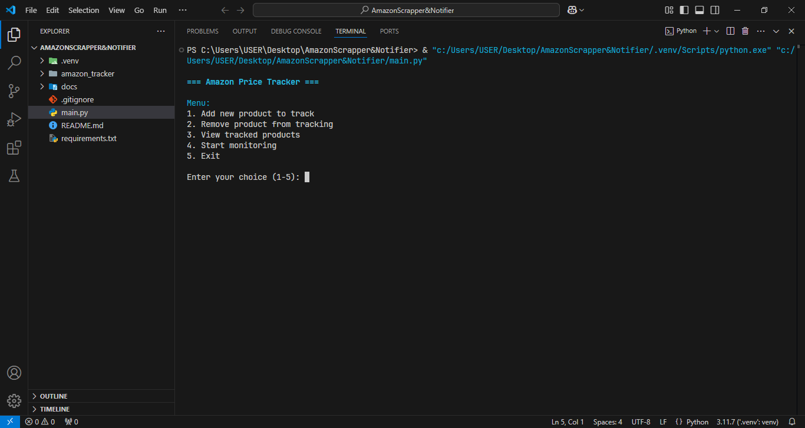
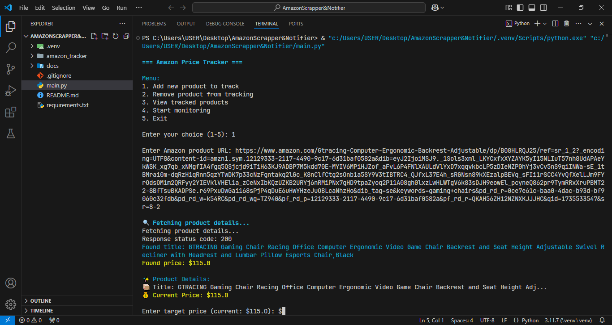
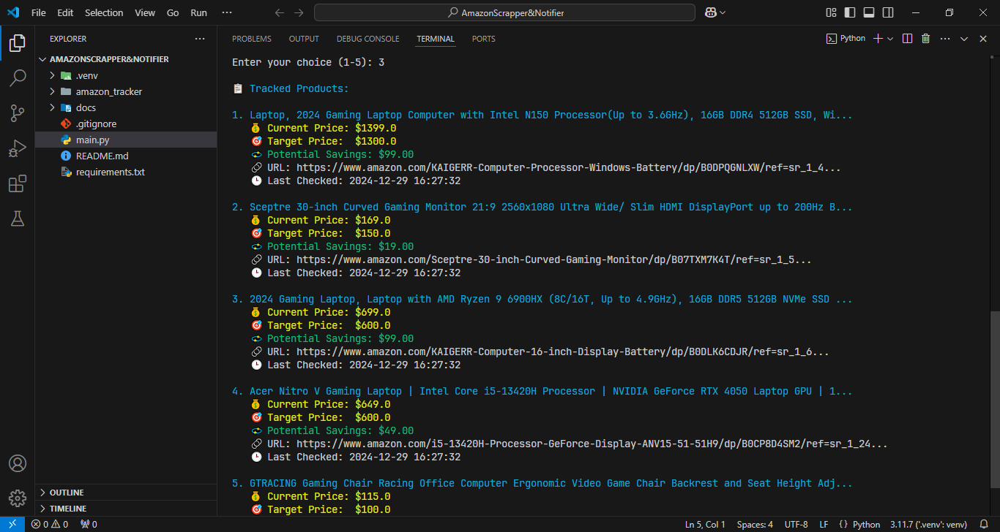

# 🛍️ Amazon Price Tracker

A Python-based Amazon price tracker that monitors product prices and sends email notifications when prices drop below your target. Features a user-friendly CLI interface with real-time price monitoring and beautiful formatting.

## 🎬 Demo

### Main Menu Interface


### Adding New Products


### Tracked Products Overview


## ✨ Features

- 📦 Track multiple Amazon products simultaneously
- 💌 Beautiful HTML email notifications when prices drop
- 💾 Persistent product storage (saves your tracked products)
- 🎯 Set target prices for each product
- ⏲️ Customizable check intervals
- 🔄 Smart price caching to avoid unnecessary requests
- 📊 Real-time price monitoring with countdown timer
- 🎨 Beautiful CLI interface with color formatting

## 🚀 Installation

1. Clone the repository:
```bash
git clone https://github.com/ImranDevPython/amazon-price-tracker.git
cd amazon-price-tracker
```

2. Install required packages:
```bash
pip install -r requirements.txt
```

3. Set up Gmail App Password:
   - Go to your Google Account settings
   - Navigate to Security > 2-Step Verification
   - At the bottom, click on "App passwords"
   - Select "Mail" and your device
   - Copy the generated password

4. Configure email settings:
   - Copy `amazon_tracker/config/config.template.json` to `amazon_tracker/config/default_config.json`
   - Replace `"sender_email"` with your Gmail address
   - Replace `"sender_password"` with your App Password

## 💻 Usage

1. Start the tracker:
```bash
python main.py
```

2. Main Menu Options:
   - `1`: Add new product
   - `2`: Remove product
   - `3`: View tracked products
   - `4`: Start monitoring
   - `5`: Exit

### Adding Products
1. Select option `1`
2. Enter the Amazon product URL
3. Review product details
4. Enter your target price
5. Confirm to add the product

### Monitoring Prices
1. Select option `4`
2. Enter your email address for notifications
3. Set check interval (in hours)
4. Let it run! Press Ctrl+C to stop monitoring

## ⚙️ Configuration

### Email Settings
Create `amazon_tracker/config/default_config.json` from the template:
```json
{
    "sender_email": "your.email@gmail.com",
    "sender_password": "your-app-password"
}
```

### Product Data
- Products are stored in `amazon_tracker/data/products.json`
- Data is automatically saved and loaded
- Don't modify this file manually

## 🔒 Security Notes

- Never commit your `default_config.json` file
- Use Gmail App Passwords instead of your account password
- Keep your App Password secure
- The app only accesses public Amazon product pages

## 🐛 Troubleshooting

1. **Email sending fails:**
   - Verify your Gmail App Password is correct
   - Check your internet connection
   - Make sure less secure app access is enabled

2. **Price not updating:**
   - Check your internet connection
   - Verify the Amazon URL is valid
   - Try forcing a price update in the View Products menu

3. **Product not found:**
   - Ensure the URL is from Amazon
   - Try copying the URL directly from your browser
   - Check if the product is still available

## 📝 Contributing

Contributions are welcome! Please feel free to submit a Pull Request. For major changes, please open an issue first to discuss what you would like to change.

## 📄 License

This project is licensed under the MIT License - see the [LICENSE](LICENSE) file for details.

## 🙏 Acknowledgments

- Built with Python 3
- Uses BeautifulSoup4 for web scraping
- Colorama for terminal colors
- Requests for HTTP requests

## ⚠️ Disclaimer

This tool is for educational purposes only. Make sure to comply with Amazon's terms of service and robots.txt when using this tool.

## 👨‍💻 Author

**Imran** - [ImranDevPython](https://github.com/ImranDevPython)
